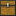
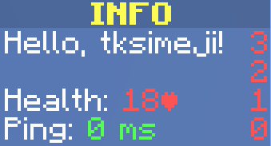

# Visualkit


Visualkit is a free, open-source GUI framework for [Paper](https://papermc.io/software/paper) server.

Maximum respect to [Bram Moolenaar](https://github.com/brammool), the developer of [Vim](https://www.vim.org/).

I also sympathized with his philanthropic side, so I decided to add the same text as the Vim startup screen to the
Visualkit banner.

#### "Help poor children in Uganda!"

Donate to the future of Uganda's children!

##  Get Started

Add Visualkit to your plugin's dependencies.

Visualkit is available on Maven Central. To add dependency using Gradle, write the following in your `build.gradle` (
Groovy DSL)

```groovy
dependencies {
    compileOnly 'com.tksimeji:visualkit:x.y.z'
}
```

or in the `build.gradle.kts` file (Kotlin DSL)

```kotlin
dependencies {
    compileOnly("com.tksimeji:visualkit:x.y.z")
}
```

To add a dependency using Maven, write the following in `pom.xml`

```xml
<dependency>
    <groupId>com.tksimeji</groupId>
    <artifactId>visualkit</artifactId>
    <version>x.y.z</version>
    <scope>provided</scope>
</dependency>
```

Next, specify the plugin dependencies.
Write the following in `plugin.yml`.

```yaml
depend:
  - Visualkit
```

However, the case of `paper-plugin.yml` seems to
be [slightly different](https://docs.papermc.io/paper/dev/getting-started/paper-plugins).

For a plugin that uses Visualkit to work, Visualkit must be installed as a plugin on the server along with the plugin.

Installing it on the server is no different from a normal plugin.
Just download the jar file from "Releases" and place it in the plugins directory on you server.


##  Placeholders

<a id="2479b5e2-7a0e-4a02-8e73-9ab045086560"></a>

In GUIs created with Visualkit, you can use placeholders for text.

```java
VisualkitElement
        .create(Material.NAME_TAG)
        .title(Component.text("Hello, ${name}."));
```

The placeholders are replaced with field values from the GUI implementation class
at rendering time and automatically updated.

If these values are of type object, they will be processed with `Object#toString()`,
expect that the implementation of `net.kyori.adventure.text.Component` will be embedded as is.

You can also use the "&" symbol to decorate text.

e.g: ```&aHello, world!```

##  Create a chest GUI

Create a user interface using a chest.

### 1. Create a class that extends `com.tksimeji.visualkit.ChestUI`

You need to implement a title() method that returns `net.kyori.adventure.text.Component`
and a size() method that defines the size of the chest.

```java
public class MyChestUI extends ChestUI {
    public MyChestUI(@NotNull Player player) {
        super(player);
    }

    @Override
    public @NotNull Component title() {
        return Component.text("Cookie clicker").decorate(TextDecoration.BOLD);
    }

    @Override
    public @NotNull Size size() {
        return Size.SIZE_9;
    }    
}
```

### 2. Add element

Let's add elements to the GUI.

The simplest way to declare an element is to define a field in the class.

Add `com.tksimeji.visualkit.api.Element` to a field of type `com.tksimeji.visualkit.element.VisualkitElement`.

```java
private int count;

@Element(13)
private final VisualkitElement cookieButton = VisualkitElement
        .create(Material.COOKIE)
        .title(Component.text("Click me!").color(NamedTextColor.GREEN).decorate(TextDecoration.BOLD))
        .lore(Component.text("Clicks: ${count}"));
```

Alternatively, you can specify an `org.bukkit.inventory.ItemStack`.

```java
@Element(13)
private final ItemStack cookieButton = new ItemStack(Material.COOKIE, 1);
```

The annotation parameter specifies the index in the GUI.

You can place it in multiple slots:

```java
@Element({2, 3, 5, 7, 11, 13, 17, 19})
```

You can also use asm (Advanced Slot Mapping) for more advanced specifications.

```java
@Element(asm = {@Asm(from = 0, to = 8), @Asm(from = 18, to = 26), @Asm({27, 28})}, value = {29, 30})
```

If you want to dynamically add or remove elements, use `com.tksimeji.visualkit.ChestUI#setElement(...)`

```java
// You can specify an VisualkitElement
setElement(0, VisualkitElement.create(Material.COOKIE).title(Component.text("Click me!")));

// You can specify an ItemStack
setElement(0, new ItemStack(Material.COOKIE, 1));

// Empty a slot
setElement(0, null);
```

### 3. Add handler

Define a method to handle clicks on any slot.

Add a method with the annotation `com.tksimeji.visualkit.api.Handler`.
In addition to slots, you can add click and mouse conditions to the Handler annotation.

```java
@Handler(slot = 13, click = Click.SINGLE, mouse = {Mouse.LEFT, Mouse.RIGHT})
public void onCookieClick() {
    count ++;
}
```

Of course, you can also use asm to specify the slot.

```java
@Handler(asm = {@Asm(from = 0, to = 8)}, slot = {9, 10})
```

It can also take slot, click, and mouse state as arguments.
However, these arguments are injected only if the following conditions are met:

| Name   | Type                               |
|:-------|:-----------------------------------|
| $slot  | `int` / `java.lang.Integer`        |
| $click | `com.tksimeji.visualkit.api.Click` |
| $mouse | `com.tksimeji.visualkit.api.Mouse` |

This is useful when you specify a broad conditions in the annotation.

```java
@Handler(slot = 0)
public void onClick(int $slot, Click $click, Mouse $mouse) {
    // do something
}
```

### 4. Display the GUI

All you have to do is create an instance.
Basically, you need to pass in the player as an argument.

```java
new MyChestUI(player);
```

The GUI will be displayed to the player specified as an argument.

##  Create a Panel GUI

The Panel GUI is a user interface that utilizes the scoreboard sidebar.

### 1. Create a class that extends `com.tksimeji.visualkit.SharedPanelUI`

You need to define a title method that returns a `net.kyori.adventure.text.Component`.

```java
public class MyPanelUI extends PanelUI {
    @Override
    public @NotNull Component title() {
        return Component.text("INFO").color(NamedTextColor.YELLOW).decorate(TextDecoration.BOLD);
    }
}
```

### 2. Write text on the panel

Here we'll use the constructor to write to it.

Let's display the player's information as an example.
[Placeholder](#2479b5e2-7a0e-4a02-8e73-9ab045086560) are used to embed values.

The values is updated using the `onTick` method.

```java
private String name;
private int health;
private int ping;

public MyPanelUI(@NotNull Player player) {
    super(player);
    
    add(Component.text("Hello, ${name}!"));
    add();
    add(Component.text("Health:").appendSpace().append(Component.text("${health}♥").color(NamedTextColor.RED)));
    set(3, Component.text("Ping:").appendSpace().append(Component.text("${ping} ms").color(NamedTextColor.GREEN)));
}

// Some code omitted //

@Override
public void onTick() {
    name = player.getName();
    health = (int) player.getHealth();
    ping = player.getPing();
}
```

This time we created a panel for one player,
but if you want to display the same panel for multiple players,
try extending `com.tksimeji.visualkit.SharedPanelUI`.

### 3. Display the GUI



```java
// If you extend com.tksimeji.visualkit.PanelUI

new MyPanelUI(player);

// If you extend com.tksimeji.visualkit.SharedPanelUI

new MyPanelUI(player1, player2);

new MyPanelUI(List.of(player1, player2));

new MyPanelUI().addAudience(player);
```
