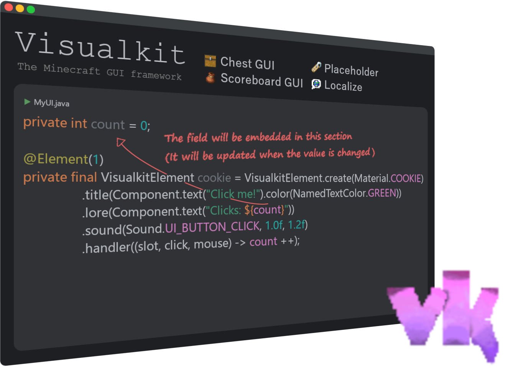

# Visualkit

The Minecraft GUI framework




Visualkit is a free, open-source GUI framework for [Paper](https://papermc.io/software/paper) server.

Maximum respect to [Bram Moolenaar](https://github.com/brammool), the developer of [Vim](https://www.vim.org/).

I also sympathized with his philanthropic side, so I decided to add the same text as the Vim startup screen to the
Visualkit banner.


#### "Help poor children in Uganda!"

Donate to the future of Uganda's children!

##  Get Started

Add Visualkit to your plugin's dependencies.

Visualkit is available on Maven Central. To add dependency using Gradle, write the following in your `build.gradle` (
Groovy DSL)

```groovy
dependencies {
    compileOnly 'com.tksimeji:visualkit:x.y.z'
}
```

or in the `build.gradle.kts` file (Kotlin DSL)

```kotlin
dependencies {
    compileOnly("com.tksimeji:visualkit:x.y.z")
}
```

To add a dependency using Maven, write the following in `pom.xml`

```xml
<dependency>
    <groupId>com.tksimeji</groupId>
    <artifactId>visualkit</artifactId>
    <version>x.y.z</version>
    <scope>provided</scope>
</dependency>
```

Next, specify the plugin dependencies.
Write the following in `plugin.yml`.

```yaml
depend:
  - Visualkit
```

However, the case of `paper-plugin.yml` seems to
be [slightly different](https://docs.papermc.io/paper/dev/getting-started/paper-plugins).

For a plugin that uses Visualkit to work, Visualkit must be installed as a plugin on the server along with the plugin.

Installing it on the server is no different from a normal plugin.
Just download the jar file from "Releases" and place it in the plugins directory on you server.


##  Placeholders

<a id="2479b5e2-7a0e-4a02-8e73-9ab045086560"></a>

In GUIs created with Visualkit, you can use placeholders for text.

```java
VisualkitElement
        .create(Material.NAME_TAG)
        .title(Component.text("Hello, ${name}."));
```

The placeholders are replaced with field values from the GUI implementation class
at rendering time and automatically updated.

If these values are of type object, they will be processed with `Object#toString()`,
expect that the implementation of `net.kyori.adventure.text.Component` will be embedded as is.

You can also use the "&" symbol to decorate text.

e.g: ```&aHello, world!```

##  Localize

The ability for players to view the UI in their own language is an important part of the UX.
Visualkit makes it easy to implement displays that match the player's language settings.

Translations are defined by language files.

The language file must be placed directly under the jar as `lang/{Minecraft locale code}.json`.
In a standard configuration for build systems such as Maven or Gradle,
it will look like this: ``src/main/resources/lang/en_us.json``.

A language file has the following syntax:

```json
{
  "greeting": "&d&lHello, ${name}!"
}
```

As you can see, every translation has a key.
There are no strict rules for the key, but dotted snake case is recommended.

In this way, translations are loaded into Visualkit by defining the language file in a specific location and syntax.
Next, let's look at how to reference the translations defined in the language file from code.

```java
// Note: These return a net.kyori.adventure.text.Component

// Get by locale code and full translation key
Language.translate(new NamespacedKey(plugin, "key"), MinecraftLocale.EN_US, "arg1=value1", "arg2=value2");

// Get by locale code and translation key
Language.translate(MinecraftLocale.EN_US, "key", "arg1=value1", "arg2=value2");

// Get by player and full translation key
Languate.translate(new NamespacedKey(plugin, "key"), player, "arg1=value1", "arg2=value2");

// Get by player and translation key
Language.translate("key", player, "arg1=value1", "arg2=value2");
```

If you pass a translation key without specifying a namespace, the namespace of the calling plugin will be automatically picked up.

Also, if a player is passed as an argument, the language setting of that player will be applied.

##  Create a chest GUI

Create a user interface using a chest.

### 1. Create a class that extends `com.tksimeji.visualkit.ChestUI`

You need to implement a title() method that returns `net.kyori.adventure.text.Component`
and a size() method that defines the size of the chest.

```java
public class MyChestUI extends ChestUI {
    public MyChestUI(@NotNull Player player) {
        super(player);
    }

    @Override
    public @NotNull Component title() {
        return Component.text("Cookie clicker").decorate(TextDecoration.BOLD);
    }

    @Override
    public @NotNull Size size() {
        return Size.SIZE_9;
    }    
}
```

### 2. Add element

Let's add elements to the GUI.

The simplest way to declare an element is to define a field in the class.

Add `com.tksimeji.visualkit.api.Element` to a field of type `com.tksimeji.visualkit.element.VisualkitElement`.

```java
private int count;

@Element(13)
private final VisualkitElement cookieButton = VisualkitElement
        .create(Material.COOKIE)
        .title(Component.text("Click me!").color(NamedTextColor.GREEN).decorate(TextDecoration.BOLD))
        .lore(Component.text("Clicks: ${count}"))
        .sound(Sound.UI_BUTTON_CLICK, 1.0f, 1.2f);

// Note: The player head API was added in 0.2.x.

VisualkitElement.head()
    .url("https");

VisualkitElement.head("http://textures.minecraft.net/texture/a60ed3827ed16f34b367ff96fdd6a56cb365f522e58122c147fc919fa90b208c");

VisualkitElement.head(UUID.fromString("ee54c324-9ab4-472e-aa4d-392f15b820fb"));

VisualkitElement.head(Bukkit.getPlayer("tksimeji"));
```

Alternatively, you can specify an `org.bukkit.inventory.ItemStack`.

```java
@Element(13)
private final ItemStack cookieButton = new ItemStack(Material.COOKIE, 1);
```

The annotation parameter specifies the index in the GUI.

You can place it in multiple slots:

```java
@Element({2, 3, 5, 7, 11, 13, 17, 19})
```

You can also use asm (Advanced Slot Mapping) for more advanced specifications.

```java
@Element(asm = {@Asm(from = 0, to = 8), @Asm(from = 18, to = 26), @Asm({27, 28})}, value = {29, 30})
```

If you want to dynamically add or remove elements, use `com.tksimeji.visualkit.ChestUI#setElement(...)`

```java
// You can specify an VisualkitElement
setElement(0, VisualkitElement.create(Material.COOKIE).title(Component.text("Click me!")));

// You can specify an ItemStack
setElement(0, new ItemStack(Material.COOKIE, 1));

// Empty a slot
setElement(0, null);
```

### 3. Add policy

A policy defines the behavior of a slot.

> [!TIP]
> The default policy is `SlotPolicy.FIXATION`

#### Defines a filed with a `com.tksimeji.visualkit.api.Policy` annotation:

```java
// The method for specifying the scope is the same as for @Element

@Policy(1)
private final SlotPolicy policy = SlotPolicy.VARIATION;

// It can be applied to the UI as well as the player's inventory
@Policy(1, target = PolicyTarget.INVENTORY)
private final SlotPolicy policy = SlotPolicy.VARIATION;
```

#### Setting policies from code:

```java
// The target will automatically be PolicyTarget.UI
@NotNull SlotPolicy getPolicy(int slot);

@NotNull SlotPolicy getPolicy(int slot, @NotNull PolicyTarget target);

// The target will automatically be PolicyTarget.UI
void setPolicy(int slot, @NotNull SlotPolicy policy);

void setPolicy(int slot, @NotNull SlotPolicy policy, @NotNull PolicyTarget target);
```

### 4. Add handler

Define a method to handle clicks on any slot.

Add a method with the annotation `com.tksimeji.visualkit.api.Handler`.
In addition to slots, you can add click and mouse conditions to the Handler annotation.

```java
@Handler(slot = 13, click = Click.SINGLE, mouse = {Mouse.LEFT, Mouse.RIGHT})
public void onCookieClick() {
    count ++;
}

// Alternatively, handlers can be specified directly on the element.

@Element(13)
private final VisualkitElement cookieButton = VisualkitElement
        .create(Material.COOKIE)
        .handler(() -> count ++);

// It can also take arguments

@Element(13)
private final VisualkitElement cookieButton = VisualkitElement
        .create(Material.COOKIE)
        .handler((slot, click, mouse) -> samething());
```

Of course, you can also use asm to specify the slot.

```java
@Handler(asm = {@Asm(from = 0, to = 8)}, slot = {9, 10})
```

It can also take slot, click, and mouse state as arguments.
However, these arguments are injected only if the following conditions are met:

| Type                               |
|:-----------------------------------|
| `int` / `java.lang.Integer`        |
| `com.tksimeji.visualkit.api.Click` |
| `com.tksimeji.visualkit.api.Mouse` |

This is useful when you specify a broad conditions in the annotation.

```java
@Handler(slot = 0)
public void onClick(int slot, Click click, Mouse mouse) {
    // do something
}
```

### 4. Display the GUI

All you have to do is create an instance.
Basically, you need to pass in the player as an argument.

```java
new MyChestUI(player);
```

The GUI will be displayed to the player specified as an argument.

##  Create a Panel GUI

The Panel GUI is a user interface that utilizes the scoreboard sidebar.

### 1. Create a class that extends `com.tksimeji.visualkit.SharedPanelUI`

```java
public class MyPanelUI extends PanelUI {
    // do something
}
```

### 2. Write text on the panel

Here we'll use the constructor to write to it.

Let's display the player's information as an example.
[Placeholder](#2479b5e2-7a0e-4a02-8e73-9ab045086560) are used to embed values.

The values is updated using the `onTick` method.

```java
private String name;
private int health;
private int ping;

public MyPanelUI(@NotNull Player player) {
    super(player);
    
    setTitle(Component.text("INFO").color(NamedTextColor.YELLOW));
    
    addLine(Component.text("Hello, ${name}!"));
    addLine();
    addLine(Component.text("Health:").appendSpace().append(Component.text("${health}♥").color(NamedTextColor.RED)));
    setLine(3, Component.text("Ping:").appendSpace().append(Component.text("${ping} ms").color(NamedTextColor.GREEN)));
}

// Some code omitted //

@Override
public void onTick() {
    name = player.getName();
    health = (int) player.getHealth();
    ping = player.getPing();
}
```

This time we created a panel for one player,
but if you want to display the same panel for multiple players,
try extending `com.tksimeji.visualkit.SharedPanelUI`.

### 3. Display the GUI


```java
// If you extend com.tksimeji.visualkit.PanelUI

new MyPanelUI(player);

// If you extend com.tksimeji.visualkit.SharedPanelUI

new MyPanelUI(player1, player2);

new MyPanelUI(List.of(player1, player2));

new MyPanelUI().addAudience(player);
```
